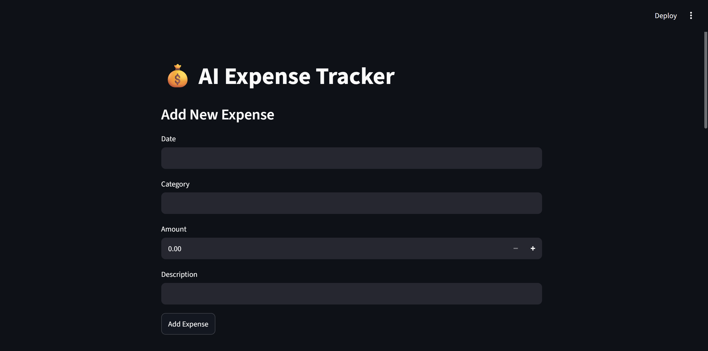
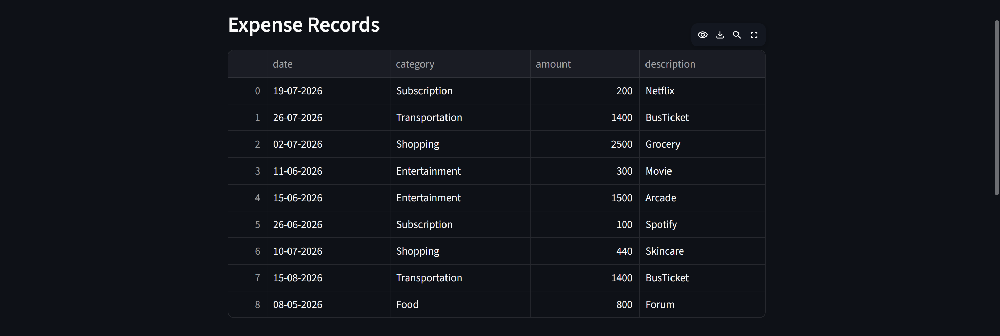
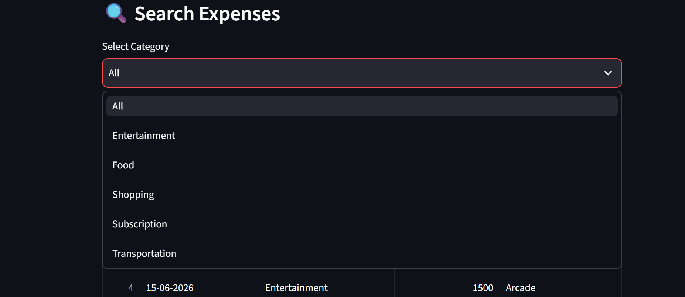
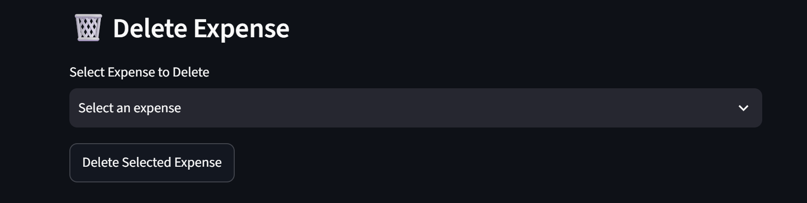
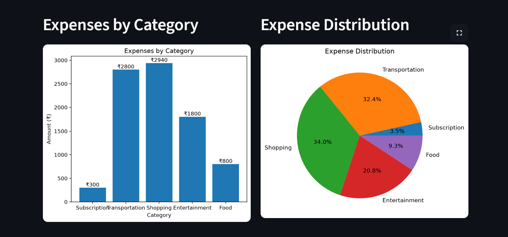

# 💰 AI Expense Tracker

A Streamlit-based Expense Tracking Dashboard built using Python, Pandas, Matplotlib, and Streamlit. This application helps users manage their daily expenses, visualize spending patterns, and gain simple AI-powered financial insights.

---

## 🚀 Features

### ✅ Expense Management
- Add new expenses
- View all expenses in a structured table
- Search expenses by category
- Delete expenses directly from the dashboard
- Persistent storage using file handling

### 📊 Data Visualization
- Category-wise Expense Bar Chart
- Expense Distribution Pie Chart
- Automatic category-wise aggregation

### 🤖 AI Insights
- Identifies highest spending category
- Calculates spending percentage by category
- Provides simple savings recommendations

### 💾 Data Persistence
- Expenses are stored in a text file
- Data remains available even after restarting the application

---

## 🛠️ Technologies Used

- Python
- Streamlit
- Pandas
- Matplotlib
- File Handling

---

## 📂 Project Structure

```text
AI_Expense_Tracker/
│
├── app.py
├── expenses.txt
├── requirements.txt
├── README.md
│
└── screenshots/
    ├── dashboard.png
    ├── ExpenseRecord.png
    ├── SearchExpense.png
    ├── DeleteExpense.png
    └── Charts.png
```

---

## 📸 Screenshots

### Dashboard



### Expense Records



### Search Expenses



### Delete Expense



### Charts & Analytics



---

## ⚙️ Installation

### Clone the Repository

```bash
git clone https://github.com/varshinikk04/AI_Expense_Tracker.git
```

### Navigate to Project Folder

```bash
cd AI_Expense_Tracker
```

### Install Dependencies

```bash
pip install -r requirements.txt
```

### Run the Application

```bash
streamlit run app.py
```

---

## 📈 Dashboard Capabilities

### Expense Entry
Users can add expenses by entering:
- Date
- Category
- Amount
- Description

### Expense Search
Users can filter and search expenses based on categories using a dropdown menu.

### Expense Deletion
Users can select and remove unwanted expenses from the dashboard.

### Expense Visualization
The application automatically generates:
- Bar Chart for category-wise spending
- Pie Chart for spending distribution

### AI-Based Insights
The dashboard analyzes expense records and provides:
- Highest spending category
- Percentage contribution of top spending category
- Potential savings recommendation

---

## 📈 Future Enhancements

- Monthly Expense Tracking
- Budget Management Module
- CSV Export Feature
- Expense Editing Functionality
- Expense Prediction using Machine Learning
- SQLite Database Integration
- User Authentication System
- Cloud Deployment

---

## 🎯 Learning Outcomes

Through this project, I gained practical experience in:

- Python Programming
- File Handling
- Data Structures
- Data Visualization
- Streamlit Web Application Development
- Interactive Dashboard Design
- CRUD Operations
- Basic AI-Based Financial Insights
- Git & GitHub Project Management

---

## 👩‍💻 Author

**Varshini Krishnakumar**
Final Year Electronics and Communication Engineering Student
Interested in Data Analytics, Data Science, Python Development, and AI-powered Applications.
⭐ If you found this project useful, feel free to star the repository and share your feedback.